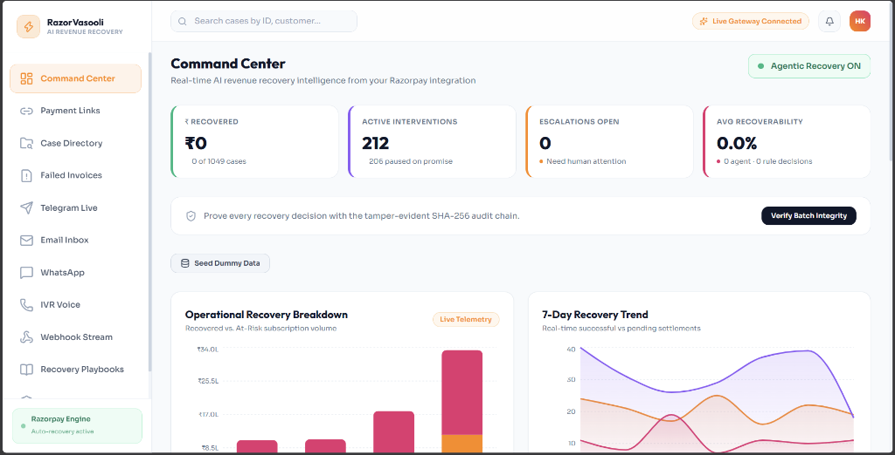
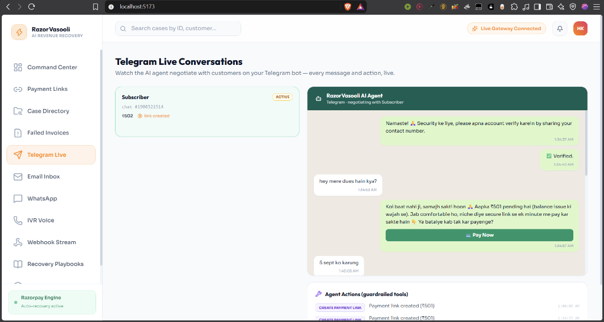
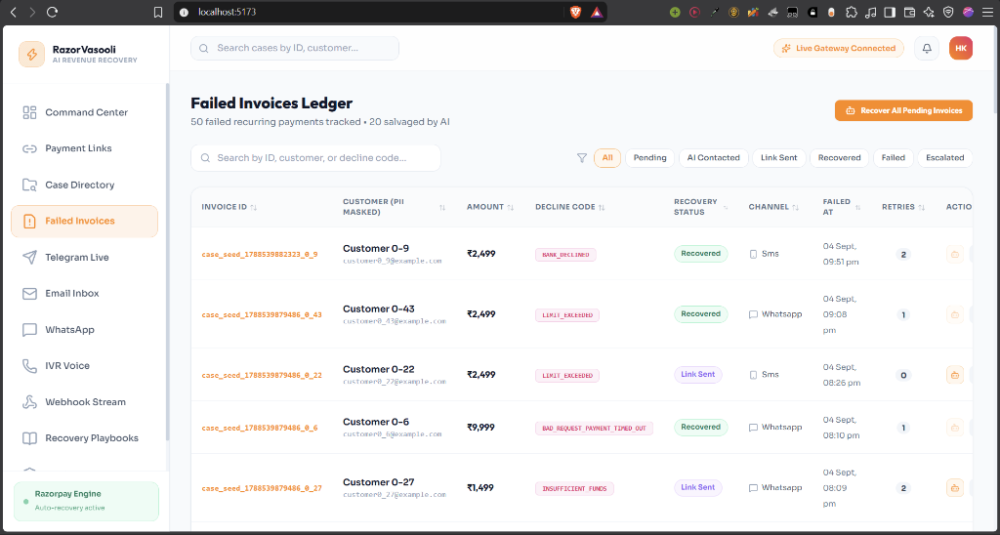
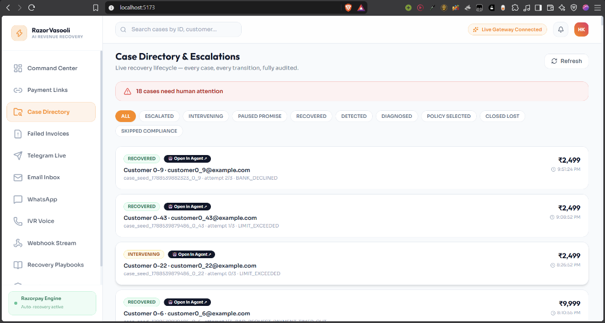
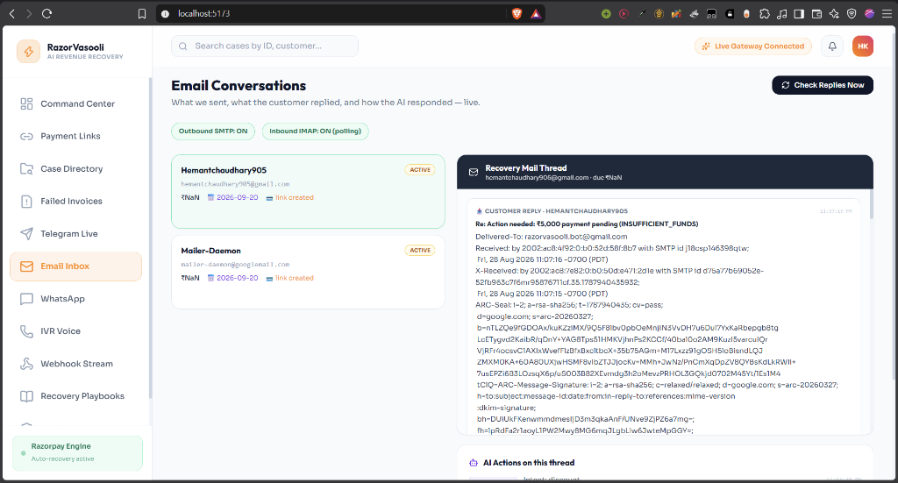

# RazorVasooli.Ai — AI Revenue Recovery Agent

RazorVasooli.Ai is an autonomous, regulatory-compliant AI revenue recovery agent natively integrated with Razorpay. It detects payment failures, cart abandonments, and overdue invoices, diagnoses root causes, negotiates via conversational Hinglish across Telegram, WhatsApp, Email, and Voice, and executes 1-click settlement.

---

## 📸 Live Dashboard & Product Screenshots

### 1. Command Center
Real-time revenue recovery intelligence, live ₹ recovered KPIs, active interventions, and SHA-256 batch integrity verification.


---

### 2. Autonomous Telegram AI Agent
Live AI agent negotiating with customers in empathetic Hinglish on Telegram, applying policy-bounded discounts, and generating 1-click Razorpay payment links.


---

### 3. Failed Invoices Ledger
Granular tracking of recurring invoice failures, decline codes (`BANK_DECLINED`, `INSUFFICIENT_FUNDS`), recovery status tags, and retries.


---

### 4. Case Directory & Escalation Queue
Full case lifecycle state machine tracking (`DETECTED` ➔ `DIAGNOSED` ➔ `INTERVENING` ➔ `PAUSED PROMISE` ➔ `RECOVERED` / `ESCALATED`).


---

### 5. Inbound/Outbound Email Thread & NLU Intent Intake
Live email thread view tracking real outbound SMTP recovery messages and inbound IMAP customer replies with automated AI actions.


---

## 🚀 How to Run the Project (Step-by-Step)

### 1. Prerequisites
- **Node.js**: v20+ (recommended v22)
- **Docker & Docker Compose**: (for PostgreSQL, Redis & Mailpit)

---

### 2. Install Dependencies
```bash
npm install
```

---

### 3. Setup Environment Variables
Make sure your `.env` file exists in the root directory (or copy from `.env.example`):
```bash
cp .env.example .env
```

---

### 4. Start Supporting Services (Docker)
Start PostgreSQL (with `pgvector`), Redis (BullMQ), and Mailpit:
```bash
docker compose up -d postgres redis mailpit
```

*To verify containers are running:*
```bash
docker ps
```

---

### 5. Start the Application
Run both backend and frontend together with a single command:
```bash
npm run dev:all
```

*Alternatively, run in separate terminals:*
```bash
# Terminal 1 — Backend Server
npm run server

# Terminal 2 — Frontend Dashboard
npm run dev
```

---

## 🌐 Application URLs

| Service | URL | Description |
|---|---|---|
| **Frontend Dashboard** | [http://127.0.0.1:5173](http://127.0.0.1:5173) | Main RazorVasooli React/Vite UI |
| **Backend API** | [http://127.0.0.1:5000](http://127.0.0.1:5000) | Express REST API & Webhook Ingress |
| **Mailpit Web UI** | [http://127.0.0.1:8025](http://127.0.0.1:8025) | View sent customer recovery emails |

---

## 👤 Default Login Credentials
If authentication is enabled on the dashboard:
* **Email:** `admin@razorvasooli.in`
* **Password:** `Hemant123`

---

## 🧪 Demo Data & Seed (Optional)
To populate the dashboard with sample recovery cases and A/B test batches:
```bash
# Seed fresh demo batches
npm run demo:seed

# Run batch recovery simulation
npm run simulate:batch
```

---

## 🛑 How to Stop Everything

```bash
# Stop dev server in terminal
Ctrl + C

# Stop Docker containers
docker compose down
```
